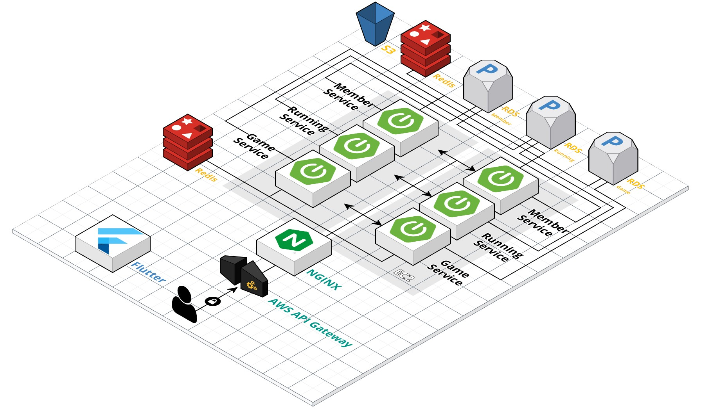

# 🏃 니땅내땅


<br />


## 💁 프로젝트 소개
 

[개요] 땅 따먹기와 달리기를 결합한 러닝 앱  

[기간] 2023.04.10~2023.05.19 (7주)  

[소속] SSAFY 8기 2학기 자율 프로젝트 

<br />


## 🏷 기획의도
러닝과 땅따먹기를 결합한 컨텐츠를 개발하여 MZ세대의 건강 트렌드인 '헬시 플레저'를 추구하는 서비스를 만들었습니다. ‘니땅내땅’은 매일 한 번씩 게임을 플레이하면서 자신의 영토를 확장하고, 다른 사용자의 영토를 뺏을 수 있는 요소를 포함하고 있습니다. 게임 참여를 통해 사용자는 건강한 즐거움을 느끼고, 지역의 러닝인들과 함께 달리기를 즐길 수 있습니다.
<br />


## 🛠️ 기술 스택 및 환경

BackEnd
- Spring Boot 2.7.10
- Spring Batch
- AWS RDS
- AWS API Gateway
- Redis

FrontEnd
- Flutter(3.11.0)
- Dart 3.1.0

CI/CD
- AWS EC2 (Ubuntu 20.04 LTS)
- Docker 23.0.1
- TeamCity 2022.04.2
- nginx/1.18.0 


<br />


## 💻 아키텍처


<br />


## 📋 요구사항 명세서


<br />


## ✔️ ERD


<br />


## 📁 프로젝트 파일 구조

#### BackEnd


#### FrontEnd


<br />


## ⭐ 주요 기능 소개

#### 1️⃣ 

#### 2️⃣  

#### 3️⃣  

#### 4️⃣ 


<br />


## 🤜 팀원

👩‍💻 김선규 - 팀장, BE   

👨‍💻 문태호 - BE, Infra   

👨‍💻 원채령 - FE  

👩‍💻 이수아 - BE   

👨‍💻 정혜수 - PM, FE   

👨‍💻 최보영 - FE 
 

<br />
<br />


## 📌 Git 사용 규칙
<br/>

### 브랜치 생성, 병합
---
💡 사용 브랜치

- feature - develop에서 feature 분기, 기능 추가 후 develop에 병합
- develop - feature, release를 병합하기 위해 사용
- master - release 브랜치만 병합
</br></br>


💡 feature 브랜치 생성 및 종료 과정

```bash
// feature 브랜치(feature/login)를 'develop' 브랜치에서 분기
git checkout -b feature/login develop

/* ~ feature 브랜치에서 새로운 기능에 대한 코드 작성 ~ */
git add [작성 파일]
git commit -m "type: Subject"
git push origin feature/login

// 'develop' 브랜치로 이동한다.
git checkout develop

// 'develop' 브랜치에 feature/login 브랜치 내용을 병합(merge)한다.
git merge --no-ff feature/login

// Merging 메시지 입력
i 누르기 (INSERT 모드)
# 무시하고 아래로 이동해서 type: Subject 커밋 메시지 입력
입력 후 esc
:wq + enter

// (삭제 안해도됌) -d 옵션: feature/login에 해당하는 브랜치를 삭제한다.
git branch -d feature/login

// 'develop' 브랜치를 원격 중앙 저장소에 올린다.
git push origin develop
```

</br></br>

###  Commit Convention
---
```
커밋 메시지 양식

type: Subject 설명

ex) 
feat: Add 로그인 유효성 검사 기능
```
</br>

💡 type 규칙
- feat: 새로운 기능 추가
- fix: 버그 수정
- docs: 문서 수정
- style: 코드 포맷 변경, 세미콜론 누락, 코드 변경 없음
- refactor: 프로덕션 코드 리팩터링
- test: 테스트 추가, 테스트 코드 리팩터링, 프로덕션 코드 변경 없음
- chore: 빌드 테스크 업데이트, 패키지 매니저 환경설정, 프로덕션 코드 변경 없음
</br> </br>

💡 Subject 규칙
- 동사(ex. Add, Update, Modify)로 시작
- 첫 글자 대문자
- 끝에 마침표 x

</br></br>
